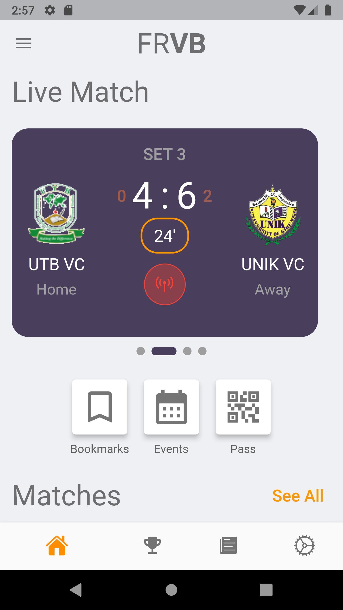
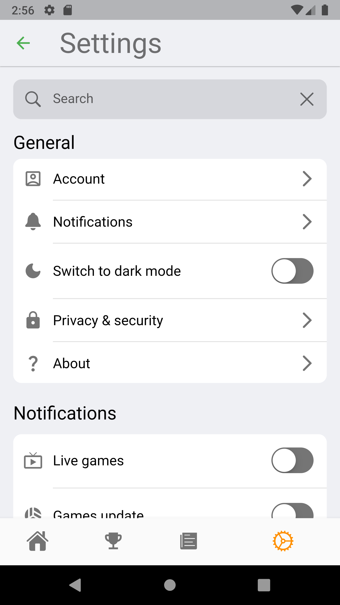

# FRVP APP

A new Flutter project.

## Getting Started

This project is a starting point for an FRVB Mobile application, that is designed to work on all mobile device.
The code will be adapted to web use as well, but it will not be responsive, nor recommended

A few resources to get you started if this is your first Flutter project:

- [Lab: Write your first Flutter app](https://docs.flutter.dev/get-started/codelab)
- [Cookbook: Useful Flutter samples](https://docs.flutter.dev/cookbook)

For help getting started with Flutter development, view the
[online documentation](https://docs.flutter.dev/), which offers tutorials,
samples, guidance on mobile development, and a full API reference.
# frvb_app

## HOME PAGE
As you can see , this screen is for the homepage of the app,
This homepage is divided into sections, (Live games, Quick Actions and matches)

#Live Matches
Live matches can sometimes be empty, so a widget of empty live game will be displayedinstead, and take up smaller space,
but when a live match is present, the card shows all information about goals in each set, the current set, ....

#Quick action buttons
They help the user to navigate through diffrent locations of things like favorites, reservation QR codes in his wallet, and to see the page of all events

## SETTINGS PAGE

Settings page help to customise the app according to the users preference,
the user can switch to the dark or light mode (System mode is selected by default),
the user can turn off notifications, or using the second card, the user can manipulate notifications in details.

